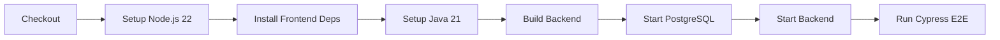

<div align="center">

# 🛒 E-commerce Product Management System

### Hệ thống quản lý sản phẩm thương mại điện tử

[](https://openjdk.org/)
[](https://spring.io/projects/spring-boot)
[](https://reactjs.org/)
[](https://www.postgresql.org/)
[](https://www.docker.com/)

[Tính năng](#-tính-năng-chính) • [Cài đặt](#-cài-đặt) • [Khởi động](#-khởi-động-ứng-dụng) • [Testing](#-chạy-tests) • [CI/CD](#-cicd-pipeline) • [API](#-api-documentation)

</div>

---

## 📋 Mục lục

- [🎯 Tính năng chính](#-tính-năng-chính)
- [🛠 Công nghệ sử dụng](#-công-nghệ-sử-dụng)
- [💻 Yêu cầu hệ thống](#-yêu-cầu-hệ-thống)
- [📦 Cài đặt](#-cài-đặt)
- [🚀 Khởi động ứng dụng](#-khởi-động-ứng-dụng)
- [🧪 Chạy Tests](#-chạy-tests)
- [🔄 CI/CD Pipeline](#-cicd-pipeline)
- [📊 Performance Testing](#-performance-testing)
- [📚 API Documentation](#-api-documentation)
- [🔐 Security Features](#-security-features)
- [📁 Cấu trúc Project](#-cấu-trúc-project)
- [🐛 Troubleshooting](#-troubleshooting)

---

## 🎯 Tính năng chính

<table>
<tr>
<td width="50%">

### 👤 Quản lý User
- ✅ Đăng ký tài khoản
- ✅ Đăng nhập JWT
- ✅ Authentication & Authorization
- ✅ Quản lý session

</td>
<td width="50%">

### 📦 Quản lý Sản phẩm
- ✅ CRUD operations
- ✅ Phân trang & Sắp xếp
- ✅ Tìm kiếm & Lọc
- ✅ Validation đầy đủ

</td>
</tr>
<tr>
<td>

### 🔒 Bảo mật
- ✅ JWT Token (HttpOnly Cookie)
- ✅ Password Encryption (BCrypt)
- ✅ XSS Protection
- ✅ SQL Injection Prevention

</td>
<td>

### 🧪 Testing
- ✅ Unit Tests (90%+ coverage)
- ✅ Integration Tests
- ✅ E2E Tests (Cypress)
- ✅ Performance Tests (K6)

</td>
</tr>
</table>

---

## 🛠 Công nghệ sử dụng

### Backend Stack
```
┌─────────────────────────────────────┐
│  Spring Boot 3.5.7                  │
│  ├── Spring Security + JWT          │
│  ├── Spring Data JPA                │
│  ├── PostgreSQL Database            │
│  └── Maven Build Tool               │
└─────────────────────────────────────┘
```

### Frontend Stack
```
┌─────────────────────────────────────┐
│  React 18.3.1 + Vite                │
│  ├── React Router DOM               │
│  ├── Axios (HTTP Client)            │
│  ├── CSS Modules                    │
│  └── Jest + Cypress                 │
└─────────────────────────────────────┘
```

### DevOps & Testing
```
┌─────────────────────────────────────┐
│  Docker + Docker Compose            │
│  ├── GitHub Actions (CI/CD)         │
│  ├── K6 (Performance Testing)       │
│  ├── JaCoCo (Code Coverage)         │
│  └── Grafana + InfluxDB             │
└─────────────────────────────────────┘
```

---

## 💻 Yêu cầu hệ thống

| Công cụ | Version | Ghi chú |
|---------|---------|---------|
| **Node.js** | ≥ 22.x | [Download](https://nodejs.org/) |
| **Java** | 21 (Temurin) | [Download](https://adoptium.net/) |
| **Docker** | ≥ 20.x | [Download](https://www.docker.com/) |
| **Docker Compose** | ≥ 2.x | Đi kèm với Docker Desktop |
| **Maven** | ≥ 3.8 | Hoặc dùng Maven Wrapper |

---

## 📦 Cài đặt

### Bước 1: Clone Repository

```bash
git clone <repository-url>
cd <project-directory>
```

### Bước 2: Cài đặt Backend

```bash
cd backend
./mvnw clean install -DskipTests
```

> 💡 **Lưu ý:** Lần đầu chạy sẽ tải dependencies, có thể mất vài phút.

### Bước 3: Cài đặt Frontend

```bash
cd frontend/my-react-app
npm install
```

---

## 🚀 Khởi động ứng dụng

### 🐘 Khởi động PostgreSQL Database

```bash
cd backend
docker-compose up -d
```

**📊 Thông tin kết nối Database:**

| Thuộc tính | Giá trị |
|------------|---------|
| Host | `localhost` |
| Port | `5432` |
| Database | `ktpm` |
| Username | `root` |
| Password | `password` |

**Kiểm tra database đã chạy:**
```bash
docker ps
# Hoặc
docker logs ktpm-db
```

---

### ☕ Khởi động Spring Boot Backend

**Cách 1: Chạy trực tiếp với Maven**

```bash
cd backend
./mvnw spring-boot:run
```

**Cách 2: Build JAR và chạy**

```bash
cd backend
./mvnw clean package -DskipTests
java -jar target/*.jar
```

**✅ Backend sẽ chạy tại:** `http://localhost:8080`

**Test API:**
```bash
curl http://localhost:8080/api/auth/current
```

---

### ⚛️ Khởi động React Frontend

```bash
cd frontend/my-react-app
npm run dev
```

**✅ Frontend sẽ chạy tại:** `http://localhost:3000`

**🎉 Mở browser và truy cập:** [http://localhost:3000](http://localhost:3000)

---

## 🧪 Chạy Tests

### 📘 Backend Tests (Maven + JUnit 5)

#### Chạy tất cả tests

```bash
cd backend
./mvnw test
```

#### Chạy tests với coverage report (JaCoCo)

```bash
./mvnw clean verify
```

📈 **Coverage report:** `backend/target/site/jacoco/index.html`

#### Chạy specific test class

```bash
# Test một class cụ thể
./mvnw test -Dtest=AuthServiceUnitTest

# Test một method cụ thể
./mvnw test -Dtest=AuthServiceUnitTest#loginUserSuccess
```

#### 📋 Danh sách Test Categories

<details>
<summary><b>🔹 Unit Tests</b></summary>

- `AuthServiceUnitTest` - Test business logic đăng nhập/đăng ký
- `ProductServiceTest` - Test CRUD operations
- `ProductServiceMockTest` - Test với Mockito
- `ValidatorTest` - Test validation logic

</details>

<details>
<summary><b>🔹 Integration Tests</b></summary>

- `ProductIntegrationTest` - Test full flow CRUD với H2
- `AuthControllerIntegrationTest` - Test API endpoints

</details>

<details>
<summary><b>🔹 Security Tests</b></summary>

- `XssSecurityTest` - Test XSS prevention
- `SqlInjectionSecurityTest` - Test SQL injection prevention
- `CsrfSecurityTest` - Test CSRF protection
- `AuthenticationBypassSecurityTest` - Test authentication bypass

</details>

---

### 📗 Frontend Tests (Jest + React Testing Library)

#### Chạy tất cả tests

```bash
cd frontend/my-react-app
npm test
```

#### Chạy tests với coverage

```bash
npm test -- --coverage
```

#### Chạy tests ở watch mode

```bash
npm test -- --watch
```

#### 📋 Danh sách Test Categories

<details>
<summary><b>🔹 Unit Tests</b></summary>

- `validate.test.js` - Test validation functions
- `productValidation.test.js` - Test product validation (TDD)

</details>

<details>
<summary><b>🔹 Mock Tests</b></summary>

- `login.test.js` - Test login với mocked API
- `ProductCRUDMock.test.js` - Test CRUD với mocked services

</details>

<details>
<summary><b>🔹 Integration Tests</b></summary>

- `login.integration.test.js` - Test login flow
- `ProductIntegration.test.js` - Test product management flow
- `ProductForm.test.js` - Test form components

</details>

---

### 🎭 E2E Tests (Cypress)

#### Mở Cypress Test Runner (Interactive mode)

```bash
cd frontend/my-react-app
npm run cypress:open
```

#### Chạy Cypress Headless

```bash
npm run cypress:run
```

#### 📋 Test Files

- `cypress/e2e/login.cy.js` - Login flow tests
- `cypress/e2e/product.cy.js` - Product CRUD tests
- `cypress/component/ProductManagementPage.cy.jsx` - Component tests

---

## 🔄 CI/CD Pipeline

### 🤖 GitHub Actions Workflow

Pipeline tự động chạy khi:

- ✅ Push code lên branch `main`
- ✅ Tạo Pull Request vào `main`
- ✅ Trigger thủ công qua `workflow_dispatch`

### 📋 Pipeline Steps



### 🔍 Xem kết quả Pipeline

1. Truy cập GitHub repository
2. Vào tab **Actions**
3. Chọn workflow run để xem chi tiết
4. Xem logs và test results

### 🏃 Chạy Pipeline locally

```bash
# 1. Start PostgreSQL
cd backend && docker-compose up -d

# 2. Build & Start Backend
./mvnw clean package -DskipTests
java -jar target/*.jar &

# 3. Install & Start Frontend
cd ../frontend/my-react-app
npm ci
npm run dev &

# 4. Run Cypress tests
npm run cypress:run
```

---

## 📊 Performance Testing

### 🚀 Sử dụng K6 Load Testing

#### Setup Monitoring Stack (Optional)

```bash
cd k6
docker-compose up -d
```

🎨 **Grafana Dashboard:** `http://localhost:3001` (admin/admin)

#### Chạy Load Tests

```bash
# Login Load Test: 100 → 500 → 1000 users
k6 run --out influxdb=http://localhost:8086/k6 \
  tests/performance/login/login-load-test.js

# Login Stress Test: Ramping up to 2500 users
k6 run --out influxdb=http://localhost:8086/k6 \
  tests/performance/login/login-stress-test.js

# Product CRUD Load Test
k6 run --out influxdb=http://localhost:8086/k6 \
  tests/performance/product/product-load-test.js
```

#### Chạy không dùng InfluxDB

```bash
k6 run tests/performance/login/login-load-test.js
```

### 📈 Performance Thresholds

| Test Type | VUs | Duration | P95 Latency | Error Rate |
|-----------|-----|----------|-------------|------------|
| Load 100 | 100 | 1m | < 1000ms | < 1% |
| Load 500 | 500 | 1m | < 2000ms | < 2% |
| Load 1000 | 1000 | 1m | < 3000ms | < 3% |
| Stress | 2500 | 5m | < 5000ms | < 5% |

---

## 📚 API Documentation

### 🔐 Authentication Endpoints

| Method | Endpoint | Description | Auth Required |
|--------|----------|-------------|---------------|
| `POST` | `/api/auth/register` | Đăng ký user mới | ❌ |
| `POST` | `/api/auth/login` | Đăng nhập (trả về JWT cookie) | ❌ |
| `GET` | `/api/auth/current` | Lấy thông tin user hiện tại | ✅ |
| `POST` | `/api/auth/logout` | Đăng xuất | ✅ |
| `DELETE` | `/api/auth/{id}` | Xóa tài khoản | ✅ |

#### 📝 Request Examples

<details>
<summary><b>POST /api/auth/register</b></summary>

```json
{
  "username": "testuser",
  "password": "Password123",
  "verifyPassword": "Password123"
}
```

**Response:** `201 Created` hoặc `409 Conflict`

</details>

<details>
<summary><b>POST /api/auth/login</b></summary>

```json
{
  "username": "testuser",
  "password": "Password123"
}
```

**Response:** `200 OK` + JWT Cookie

```json
{
  "id": "uuid",
  "username": "testuser"
}
```

</details>

---

### 📦 Product Endpoints (Yêu cầu Authentication)

| Method | Endpoint | Description |
|--------|----------|-------------|
| `GET` | `/api/products` | Lấy danh sách sản phẩm (phân trang) |
| `GET` | `/api/products/{id}` | Lấy chi tiết sản phẩm |
| `POST` | `/api/products` | Tạo sản phẩm mới |
| `PUT` | `/api/products/{id}` | Cập nhật sản phẩm |
| `DELETE` | `/api/products/{id}` | Xóa sản phẩm |

#### 🔍 Query Parameters cho GET `/api/products`

| Parameter | Type | Default | Description |
|-----------|------|---------|-------------|
| `page` | Integer | `0` | Số trang (bắt đầu từ 0) |
| `limit` | Integer | `10` | Số item per page |
| `sortBy` | String | `"id"` | Trường để sort (id, productName, price, quantity) |
| `sortDir` | String | `"asc"` | Chiều sort (asc/desc) |

#### 📝 Request Examples

<details>
<summary><b>POST /api/products</b></summary>

```json
{
  "productName": "iPhone 15 Pro",
  "price": 25000000,
  "quantity": 50,
  "description": "Flagship smartphone 2024",
  "category": "SMARTPHONE"
}
```

**Valid Categories:** `SMARTPHONE`, `LAPTOPS`, `HEADPHONES`, `CAMERAS`

</details>

---

## 🔐 Security Features

### 🛡️ Implemented Security Measures

| Feature | Implementation | Status |
|---------|----------------|--------|
| **Authentication** | JWT Token (HttpOnly Cookie) | ✅ |
| **Password Security** | BCrypt Encryption | ✅ |
| **XSS Prevention** | Input Sanitization | ✅ |
| **SQL Injection** | JPA Prepared Statements | ✅ |
| **CSRF Protection** | Configurable (disabled by default) | ⚠️ |
| **CORS** | Configured for localhost:3000 | ✅ |
| **Input Validation** | Frontend & Backend | ✅ |

### 🔒 Username & Password Rules

**Username:**
- 3-50 ký tự
- Chỉ chứa: `a-z`, `A-Z`, `0-9`, `.`, `-`, `_`
- Không có ký tự đặc biệt

**Password:**
- 6-100 ký tự
- Phải có ít nhất 1 chữ cái và 1 số
- Không có ký tự đặc biệt

---

## 📁 Cấu trúc Project

```
📦 ecommerce-system
├── 📂 backend/                         # Spring Boot Application
│   ├── 📂 src/
│   │   ├── 📂 main/
│   │   │   ├── 📂 java/com/ktpm/backend/
│   │   │   │   ├── 📂 config/         # Security & App configs
│   │   │   │   ├── 📂 controller/     # REST API Controllers
│   │   │   │   ├── 📂 dto/            # Data Transfer Objects
│   │   │   │   ├── 📂 entity/         # JPA Entities
│   │   │   │   ├── 📂 exception/      # Custom Exceptions
│   │   │   │   ├── 📂 filter/         # JWT Authentication Filter
│   │   │   │   ├── 📂 mapper/         # Entity ↔ DTO Mappers
│   │   │   │   ├── 📂 repository/     # Spring Data JPA Repos
│   │   │   │   ├── 📂 service/        # Business Logic
│   │   │   │   └── 📂 utils/          # Validation & JWT Utils
│   │   │   └── 📂 resources/
│   │   │       ├── application.yml    # App configuration
│   │   │       └── data.sql           # Initial data
│   │   └── 📂 test/                   # Backend Tests
│   │       ├── 📂 controller/         # Controller tests
│   │       ├── 📂 service/            # Service tests
│   │       ├── 📂 security/           # Security tests
│   │       ├── 📂 integration/        # Integration tests
│   │       └── 📂 utils/              # Utility tests
│   ├── docker-compose.yml             # PostgreSQL container
│   └── pom.xml                        # Maven dependencies
│
├── 📂 frontend/my-react-app/          # React Application
│   ├── 📂 src/
│   │   ├── 📂 api/                    # API Client (Axios)
│   │   │   ├── authApi.js
│   │   │   ├── productAPI.js
│   │   │   └── axiosClient.js
│   │   ├── 📂 assets/                 # Images, Icons, SVGs
│   │   ├── 📂 components/             # Reusable Components
│   │   │   ├── Cards/
│   │   │   ├── Forms/
│   │   │   ├── Headers/
│   │   │   ├── InfoBoard/
│   │   │   ├── Inputs/
│   │   │   ├── Paginations/
│   │   │   └── Sorts/
│   │   ├── 📂 models/                 # Form Models
│   │   │   ├── loginFormModel.js
│   │   │   ├── registerFormModel.js
│   │   │   ├── addProductFormModel.js
│   │   │   └── updateProductFormModel.js
│   │   ├── 📂 pages/                  # Page Components
│   │   │   ├── formPages/
│   │   │   ├── homePage/
│   │   │   ├── productPage/
│   │   │   └── protectedPage.jsx
│   │   ├── 📂 utils/                  # Utilities
│   │   │   └── validations/
│   │   ├── routes.jsx                 # Route Configuration
│   │   └── main.jsx                   # App Entry Point
│   ├── 📂 cypress/                    # E2E Tests
│   │   ├── 📂 e2e/
│   │   │   ├── login.cy.js
│   │   │   └── product.cy.js
│   │   ├── 📂 component/              # Component Tests
│   │   ├── 📂 pages/                  # Page Object Models
│   │   └── 📂 support/
│   ├── 📂 tests/                      # Jest Tests
│   │   ├── 📂 loginTest/
│   │   │   ├── unitTest/
│   │   │   ├── mockTest/
│   │   │   └── integrationTest/
│   │   └── 📂 productTest/
│   │       ├── unitTest/
│   │       ├── mockTest/
│   │       └── integrationTest/
│   ├── package.json                   # npm dependencies
│   ├── vite.config.js                 # Vite configuration
│   ├── cypress.config.js              # Cypress configuration
│   └── jest.config.cjs                # Jest configuration
│
├── 📂 k6/                             # Performance Testing
│   ├── 📂 tests/performance/
│   │   ├── 📂 login/
│   │   │   ├── login-load-test.js
│   │   │   └── login-stress-test.js
│   │   └── 📂 product/
│   │       └── product-load-test.js
│   ├── docker-compose.yml             # Grafana + InfluxDB
│   └── 📂 grafana/provisioning/
│
├── 📂 .github/workflows/              # CI/CD Pipelines
│   └── cypress-test.yml               # GitHub Actions workflow
│
└── 📄 README.md                       # This file
```

---

## 🐛 Troubleshooting

### ❌ Backend không kết nối được Database

```bash
# Kiểm tra container đang chạy
docker ps

# Xem logs container
docker logs ktpm-db

# Restart container
docker-compose restart

# Xóa và tạo lại container
docker-compose down
docker-compose up -d
```

---

### ❌ Frontend không gọi được API

**Kiểm tra:**

1. Backend có đang chạy tại port 8080?
```bash
curl http://localhost:8080/api/auth/current
```

2. CORS configuration trong `SecurityConfig.java`:
```java
config.setAllowedOrigins(List.of("http://localhost:3000"));
```

3. Mở Browser DevTools → Network tab → Xem request details

---

### ❌ Tests fail

**Backend Tests:**
```bash
# Clear Maven cache
./mvnw clean

# Force update dependencies
./mvnw clean install -U
```

**Frontend Tests:**
```bash
# Clear npm cache
npm cache clean --force

# Remove and reinstall
rm -rf node_modules package-lock.json
npm install
```

---

### ❌ Port already in use

```bash
# Backend (8080)
lsof -ti:8080 | xargs kill -9

# Frontend (3000)
lsof -ti:3000 | xargs kill -9

# PostgreSQL (5432)
docker-compose down
```

---

### ❌ JWT Token expired

- Token có thời hạn 24 giờ
- Đăng xuất và đăng nhập lại
- Clear browser cookies

---

### ❌ Cypress tests fail

```bash
# Clear Cypress cache
npx cypress cache clear

# Reinstall Cypress
npm install cypress --save-dev

# Run with debugging
DEBUG=cypress:* npm run cypress:run
```

---

## 📞 Support & Contact

Nếu gặp vấn đề, hãy:

1. 🔍 Kiểm tra [Troubleshooting](#-troubleshooting)
2. 📖 Đọc kỹ [Documentation](#-api-documentation)
3. 🐛 Tạo [Issue](https://github.com/your-repo/issues) trên GitHub
4. 💬 Liên hệ team phát triển

---

## 👥 Contributors

<table>
<tr>
<td align="center">
<b>Backend Team</b><br>
Spring Boot Development
</td>
<td align="center">
<b>Frontend Team</b><br>
React Development
</td>
<td align="center">
<b>QA Team</b><br>
Testing & Quality Assurance
</td>
</tr>
</table>

---

## 📄 License

This project is licensed under the MIT License - see the [LICENSE](LICENSE) file for details.

---

<div align="center">

### ⭐ Nếu project hữu ích, đừng quên cho một star! ⭐

**Made with ❤️ by KTPM Team**

[⬆ Về đầu trang](#-e-commerce-product-management-system)

</div>